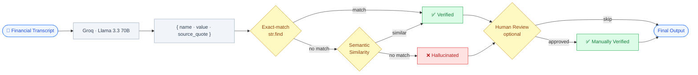
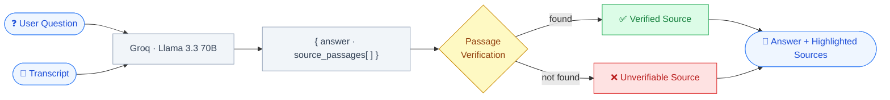

# Verifiable RAG

**Trace every AI-extracted metric back to its exact source. Ask questions. Flag hallucinations. Review with confidence.**


---

## Working Demo

https://github.com/user-attachments/assets/33534a12-6fd8-42fb-aebb-a64e2b7aa610

---

## Table of Contents

- [Description](#description)
- [Features](#features)
- [Architecture](#architecture)
- [Installation](#installation)
- [Usage](#usage)
- [Environment Variables](#environment-variables)
- [Tests](#tests)
- [Contributing](#contributing)
- [License](#license)

---

## Description

Verifiable RAG solves the core trust problem with AI in financial services: when a model reads a 100-page earnings call and tells you "Revenue grew 15%", how do you know it didn't make that up?

This tool forces the AI to return the **exact verbatim substring** it used as evidence alongside every metric it extracts. A traceability engine then performs a literal string search — if the quote doesn't exist word-for-word in the source, the metric is flagged. For borderline cases, a **semantic similarity pass** catches paraphrases the exact-match would miss.

The result is a two-panel interface: a metrics table on the left, the raw transcript on the right. Hover any metric and the exact sentence that produced it lights up in yellow. Unverified metrics can be escalated to the **Q&A panel**, where you can ask natural-language questions about the transcript and get answers with pinned source passages.

**Why this stack:**
- **FastAPI (Python)** — lightweight, fast to iterate, natural fit for LLM orchestration
- **Next.js + TypeScript** — type-safe frontend with React state for real-time hover highlighting
- **Groq + Llama 3.3 70B** — free-tier inference with JSON mode for reliable structured output

---

## Features

| Feature | Description |
|---|---|
| **Metric Extraction** | LLM extracts structured metrics (name, value, source quote) from any transcript |
| **Exact-match Verification** | `str.find()` checks whether the source quote exists verbatim in the document |
| **Semantic Verification** | Secondary LLM pass validates paraphrased quotes using semantic similarity |
| **Q&A Panel** | Ask free-form questions about the transcript; answers include highlighted source passages |
| **Human Review** | Manually approve flagged metrics after reading the source — audit trail included |
| **Demo Mode** | Runs fully offline with simulated responses — no API key required |

---

## Architecture

**Metric extraction & verification pipeline:**



**Q&A pipeline:**



---

## Installation

**Requirements:** Python 3.10+, Node.js 18+

### 1. Clone the repository

```bash
git clone https://github.com/RamyaLakshmi/Verifiable-RAG.git
cd Verifiable-RAG
```

### 2. Set up the backend

```bash
cd backend
python -m venv .venv
source .venv/bin/activate        # Windows: .venv\Scripts\activate
pip install -r requirements.txt
cp .env.example .env             # then add your GROQ_API_KEY
```

### 3. Set up the frontend

```bash
cd ../frontend
npm install
```

---

## Usage

**Start the backend** (Terminal 1):

```bash
cd backend
source .venv/bin/activate
uvicorn main:app --reload
```

**Start the frontend** (Terminal 2):

```bash
cd frontend
npm run dev
```

Open [http://localhost:3000](http://localhost:3000) in your browser.

1. The textarea is pre-filled with a sample financial transcript
2. Click **Analyze →** to extract and verify metrics
3. Hover any row in the metrics table — the exact source sentence highlights in yellow
4. Rows marked **Hallucinated** in red have quotes that could not be verified
5. Click **Ask Q&A** on any unverified metric to open the Q&A panel and investigate further
6. Use **Mark as Reviewed** to manually approve a metric after inspecting its source

> **No API key?** The app runs in demo mode automatically — no setup required to see it in action.

---

## Environment Variables

Copy `backend/.env.example` to `backend/.env` and fill in your values:

```bash
cp backend/.env.example backend/.env
```

| Variable | Required | Default | Description |
|---|---|---|---|
| `GROQ_API_KEY` | Yes (for live mode) | — | Free key from [console.groq.com](https://console.groq.com) |
| `GROQ_MODEL` | No | `llama-3.3-70b-versatile` | Use `llama-3.1-8b-instant` for lower latency |

---

## Tests

Verify the traceability engine directly without running the server:

```bash
cd backend
source .venv/bin/activate
python -c "
from main import verify_quotes, _extract_simulated, DEMO_TRANSCRIPT
metrics = _extract_simulated(DEMO_TRANSCRIPT)
verified = verify_quotes(DEMO_TRANSCRIPT, metrics)
for m in verified:
    status = 'VERIFIED' if m['verified'] else 'HALLUCINATED'
    print(f'{status:12} | {m[\"name\"]:25} | start={m[\"highlight_start\"]}')
"
```

Expected output:

```
VERIFIED     | Q4 Revenue Growth         | start=139
VERIFIED     | Annual Churn Rate         | start=254
HALLUCINATED | EBITDA Margin             | start=None
```

---

## Contributing

Contributions, issues, and feature requests are welcome.

1. Fork the repository
2. Create a feature branch: `git checkout -b feature/your-feature`
3. Commit your changes: `git commit -m 'Add your feature'`
4. Push to the branch: `git push origin feature/your-feature`
5. Open a Pull Request

Please open an issue first if you'd like to discuss a significant change.

---

## License

This project is licensed under the [MIT License](LICENSE) — © 2026 RamyaLakshmi KS.
