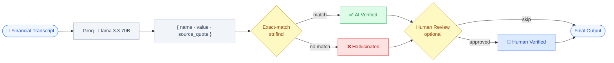
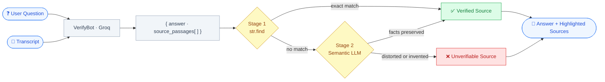

# Verifiable RAG

**Trace every AI-extracted metric back to its exact source. Ask questions. Flag hallucinations. Review with confidence.**


---

## Working Demo

https://github.com/user-attachments/assets/33534a12-6fd8-42fb-aebb-a64e2b7aa610

---

## Table of Contents

- [Description](#description)
- [Features](#features)
- [Architecture](#architecture)
- [Installation](#installation)
- [Usage](#usage)
- [Environment Variables](#environment-variables)
- [Tests](#tests)
- [Contributing](#contributing)
- [License](#license)

---

## Description

Verifiable RAG solves the core trust problem with AI in financial services: when a model reads a 100-page earnings call and tells you "Revenue grew 15%", how do you know it didn't make that up?

**Metric extraction** forces the LLM to return the exact verbatim substring it used as evidence for every figure it extracts. A strict string search then confirms the quote exists character-for-character in the source — if even one word differs, the metric is flagged.

**Q&A** goes further. When you ask a free-form question about the transcript, the AI returns an answer alongside the source passages it drew from. Those passages go through a two-stage check: an exact string match first, then — for passages that paraphrase rather than quote directly — a second LLM call that reads the transcript and judges whether the meaning and facts are faithfully preserved. A paraphrase that keeps the numbers right passes; an invented or distorted fact fails.

The result is a side-by-side interface: a metrics table on the left, the raw transcript on the right. Hover any verified metric and its source sentence highlights in yellow. Flagged metrics can be escalated to the Q&A panel for deeper investigation, and analysts can manually mark items as reviewed after reading the source.

**Why this stack:**
- **FastAPI (Python)** — lightweight, fast to iterate, natural fit for LLM orchestration
- **Next.js + TypeScript** — type-safe frontend with React state for real-time hover highlighting
- **Groq + Llama 3.3 70B** — free-tier inference with JSON mode for reliable structured output

---

## Features

| Feature | Description |
|---|---|
| **Metric Extraction** | LLM is prompted to copy source quotes character-for-character; structured output returns `name`, `value`, and `source_quote` for every figure |
| **Exact-match Verification** | `str.find()` confirms the quote exists verbatim in the transcript — intentionally strict for metrics |
| **Semantic Verification** | Q&A passages that don't match exactly go through a second LLM call that judges whether the facts and meaning are faithfully preserved, not just the wording |
| **Q&A Panel** | Ask natural-language questions about the transcript; VerifyBot returns a grounded answer with color-coded source passages |
| **Human Review** | Three audit states — AI Verified (green), Human Verified (blue), Unverified (red) — with manual approval for flagged metrics |
| **Demo Mode** | Fully offline with simulated responses — no API key required to explore the interface |

---

## Architecture

**Metric extraction & verification pipeline:**

Metrics are verified with exact string matching only. The LLM is explicitly instructed to copy quotes verbatim, so a character-level match is the right bar — any deviation is a signal the model invented or altered the quote.



**Q&A pipeline:**

Q&A passages use a two-stage check. The LLM is not required to quote verbatim when answering questions, so the verifier first tries an exact match, then falls back to a semantic LLM pass that distinguishes faithful paraphrases from fabricated or distorted facts.



---

## Installation

**Requirements:** Python 3.10+, Node.js 18+

### 1. Clone the repository

```bash
git clone https://github.com/RamyaLakshmi/Verifiable-RAG.git
cd Verifiable-RAG
```

### 2. Set up the backend

```bash
cd backend
python -m venv .venv
source .venv/bin/activate        # Windows: .venv\Scripts\activate
pip install -r requirements.txt
cp .env.example .env             # then add your GROQ_API_KEY
```

### 3. Set up the frontend

```bash
cd ../frontend
npm install
```

---

## Usage

**Start the backend** (Terminal 1):

```bash
cd backend
source .venv/bin/activate
uvicorn main:app --reload
```

**Start the frontend** (Terminal 2):

```bash
cd frontend
npm run dev
```

Open [http://localhost:3000](http://localhost:3000) in your browser.

1. The textarea is pre-filled with a sample financial transcript
2. Click **Analyze →** to extract and verify metrics
3. Hover any row in the metrics table — the exact source sentence highlights in yellow
4. **Green** rows are AI-verified; **red** rows have quotes the engine could not locate in the source
5. Click **Ask Q&A →** on any flagged metric to open the Q&A panel and ask a follow-up question
6. Q&A source passages are color-coded: green if verified, red if the claim could not be traced
7. Click **Mark as Reviewed** to promote a flagged metric to Human Verified (blue) after inspecting its source

> **No API key?** The app runs in demo mode automatically — no setup required to see it in action.

---

## Environment Variables

Copy `backend/.env.example` to `backend/.env` and fill in your values:

```bash
cp backend/.env.example backend/.env
```

| Variable | Required | Default | Description |
|---|---|---|---|
| `GROQ_API_KEY` | Yes (for live mode) | — | Free key from [console.groq.com](https://console.groq.com) |
| `GROQ_MODEL` | No | `llama-3.3-70b-versatile` | Use `llama-3.1-8b-instant` for lower latency |

---

## Tests

Verify the traceability engine directly without running the server:

```bash
cd backend
source .venv/bin/activate
python -c "
from main import verify_quotes, _extract_simulated, DEMO_TRANSCRIPT
metrics = _extract_simulated(DEMO_TRANSCRIPT)
verified = verify_quotes(DEMO_TRANSCRIPT, metrics)
for m in verified:
    status = 'VERIFIED' if m['verified'] else 'HALLUCINATED'
    print(f'{status:12} | {m[\"name\"]:25} | start={m[\"highlight_start\"]}')
"
```

Expected output:

```
VERIFIED     | Q4 Revenue Growth         | start=139
VERIFIED     | Annual Churn Rate         | start=254
HALLUCINATED | EBITDA Margin             | start=None
```

---

## Contributing

Contributions, issues, and feature requests are welcome.

1. Fork the repository
2. Create a feature branch: `git checkout -b feature/your-feature`
3. Commit your changes: `git commit -m 'Add your feature'`
4. Push to the branch: `git push origin feature/your-feature`
5. Open a Pull Request

Please open an issue first if you'd like to discuss a significant change.

---

## License

This project is licensed under the [MIT License](LICENSE) — © 2026 RamyaLakshmi KS.
